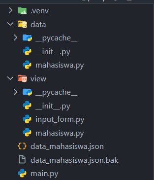

# OOP-PYTHON

## Deskripsi
Program ini merupakan program manajemen data mahasiswa yang dibangun menggunakan Python. Program ini memungkinkan pengguna untuk menambah, mengubah, menghapus, dan mencari data mahasiswa. Data mahasiswa disimpan dalam format JSON, sehingga mudah untuk dibaca dan dikelola.

## Fitur
- Tambah data mahasiswa
- Ubah data mahasiswa
- Hapus data mahasiswa
- Cari data mahasiswa berdasarkan NIM
- Tampilkan semua data mahasiswa

## Struktur Proyek




## Penggunaan
1. **Instalasi**: Pastikan Anda memiliki Python terinstal di sistem Anda. Anda dapat mengunduhnya dari [python.org](https://www.python.org/downloads/).

2. **Clone Repository**: Clone repositori ini ke mesin lokal Anda menggunakan perintah berikut:
   ```bash
   git clone https://github.com/arfianda/OOP-PYTHON.git
   cd repo
   ```

3. **Jalankan Program**

    ```bash
    python main.py
    ```

4. **Menu Utama**:Setelah program berjalan, Anda akan melihat menu utama dengan pilihan:

    - Tambah Data Mahasiswa
    - Ubah Data Mahasiswa
    - Hapus Data Mahasiswa
    - Cari Data Mahasiswa
    - Tampilkan Semua Data Mahasiswa
    - Keluar


